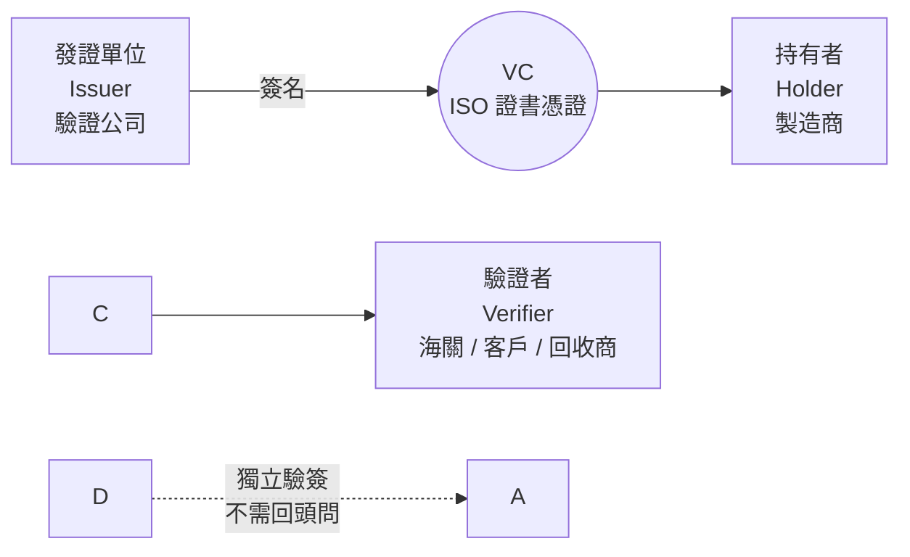
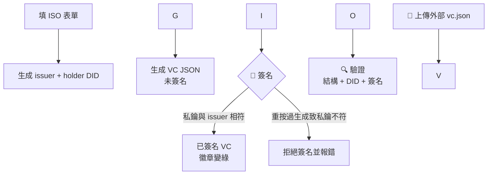

# DPP 與 VC：用途與實作方式詳解

> 本文件對應 `TODO.md` 的練習目標：從一張 ISO 證書出發，生成一張結構完整、可密碼學驗證的
> W3C Verifiable Credential（v2.0），並說明它與 DPP（Digital Product Passport，數位產品護照）的關係。
> 專案 demo 程式：`index.html`、`vc.js`（共用核心）、`did-key.js`、`did-ethr.js`、`ui.js`、`sample-iso-cert.json`；測試 `test.js`。
> 密碼學全用內建或現成函式庫：did:key 用瀏覽器 WebCrypto（離線可用），did:ethr 用 ethers.js v6（CDN）。

\---

## 目錄

1. [DPP 是什麼：為什麼世界需要數位產品護照](#1-dpp-是什麼為什麼世界需要數位產品護照)
2. [VC 是什麼：可驗證憑證](#2-vc-是什麼可驗證憑證)
3. [DID 是什麼：為什麼 issuer / holder 是一串 did:key](#3-did-是什麼為什麼-issuer--holder-是一串-didkey)
4. [可驗證怎麼做：DataIntegrityProof（eddsa-jcs-2022）](#4-可驗證怎麼做dataintegrityproofeddsa-jcs-2022)
5. [DPP × VC：為什麼拿 ISO 證書當第一個 claim](#5-dpp--vc為什麼拿-iso-證書當第一個-claim)
6. [TODO.md 逐項對應：本 demo 如何實作](#6-todomd-逐項對應本-demo-如何實作)
7. [實作詳解（一）：DID 生成](#7-實作詳解一did-生成)
8. [實作詳解（二）：JCS 正規化](#8-實作詳解二jcs-正規化)
9. [實作詳解（三）：簽名與驗證流程](#9-實作詳解三簽名與驗證流程)
10. [實作詳解（四）：驗證的三層檢查](#10-實作詳解四驗證的三層檢查)
11. [正確性證據：與 W3C 官方向量逐 byte 對打](#11-正確性證據與-w3c-官方向量逐-byte-對打)
12. [Demo 操作手冊](#12-demo-操作手冊)
13. [安全假設與已知限制](#13-安全假設與已知限制)
14. [從 demo 到真正的 DPP：路線圖](#14-從-demo-到真正的-dpp路線圖)
15. [術語表](#15-術語表)
16. [參考規範](#16-參考規範)
17. [延伸：用 did:ethr（Sepolia）簽發 VC](#17-延伸用-didethrsepolia簽發-vc)

\---

## 1\. DPP 是什麼：為什麼世界需要數位產品護照

### 1.1 一句話定義

**DPP（Digital Product Passport，數位產品護照）是一組跟著產品走、可機讀、可驗證的數位資料**：產品是什麼、誰做的、成分與碳足跡、維修與回收方式、符合哪些認證。
掃一個載體（QR code、RFID、銘牌上的 ID），任何人——消費者、海關、回收商——都能查到這份資料，而且能確認它沒被竄改、確實是發證者說的。

### 1.2 政策來源：歐盟 ESPR

* 歐盟《永續產品生態設計規範》**ESPR（Ecodesign for Sustainable Products Regulation）** 要求絕大多數實體產品都要有 DPP（食品、飼料、藥品等少數例外）。
* 先行部隊是**電池護照**（EU Battery Regulation）：電動車／工業電池的 DPP 先上路，後續 Textiles（紡織）、電子產品等分批跟上，時程以歐盟授權法案（delegated acts）公告為準。
* 背後動機有三個：**綠色轉型**（循環經濟：維修、再利用、回收需要產品資訊）、**市場監督**（海關查驗合規聲明）、**反漂綠**（環保聲明必須可查證，不能只印一句 "eco-friendly"）。

### 1.3 DPP 裡面裝什麼

ESPR 框架下，一份 DPP 典型包含：

|類別|例子|
|-|-|
|產品識別|型號、批號／序號、GTIN、製造商 ID|
|永續資訊|碳足跡、再生料比例、有害物質（SCIP）、能效|
|生命週期資訊|維修手冊、拆解指引、回收商資訊|
|合規聲明|CE、ISO 9001／14001 證書、測試報告|
|供應鏈事件|產地、加工步驟、運輸（可多次追加）|

### 1.4 為什麼 DPP 需要 VC

DPP 的資料會在**互不信任的多方之間流動**：製造商寫、供應商加、海關查、消費者看、二手商轉手。
如果只是一份 PDF 或一個網頁，會有三個問題：

1. **冒用**：任何人都能做一個長得很像的頁面，宣稱「本產品碳中和」。
2. **竄改**：轉手過程中數字被改掉（例如把碳足跡改小），看不出來。
3. **離線／跨系統**：海關系統跟廠商系統互不相通，查驗時不能每次都回打電話問發證單位。

**Verifiable Credential（VC）正是為這三件事設計的**：發證者用私鑰簽名，驗證者只憑公開資訊（DID）就能獨立驗證作者與完整性，不需要打電話回去問，也不需要跟發證者在同一個系統裡。
所以可以這樣理解：**DPP 是「應用場景與資料內容」，VC 是「讓那份資料可信的封裝格式」**。
一張 ISO 證書做成 VC，就是 DPP 拼圖的第一塊。



\---

## 2\. VC 是什麼：可驗證憑證

### 2.1 信任三角：三個角色

|角色|做什麼|在本 demo 中|
|-|-|-|
|**Issuer（發證者）**|查核事實、用私鑰簽名發憑證|模擬的驗證公司（`did:key:z…`）|
|**Holder（持有者）**|保管憑證、出示給別人看|模擬的製造商 Acme Electronics（`did:key:z…`）|
|**Verifier（驗證者）**|檢查簽名與內容，決定信不信|按「🔍 驗證」的人（海關／客戶）|

關鍵性質：**驗證不需要聯繫發證者**。Verifier 手上有 VC + issuer 的公開 DID，就能用數學確認「這份文件確實是該 issuer 簽的、且一個字都沒被改過」。
這正是紙本證書影本做不到的事：影本無法證明「影本與正本一致」，VC 可以。

### 2.2 VC 長什麼樣子（v2.0）

```json
{
  "@context": \["https://www.w3.org/ns/credentials/v2"],
  "id": "urn:uuid:58172aac-d8ba-11ed-83dd-0b3aef56cc33",
  "type": \["VerifiableCredential", "IsoCertificationCredential"],
  "issuer": "did:key:z6MkhaXgBZDvotDkL5257faiztiGiC2QtKLGpbnnEGta2doK",
  "validFrom": "2026-09-22T00:00:00Z",
  "validUntil": "2029-09-16T00:00:00Z",
  "credentialSubject": {
    "id": "did:key:z6MkpTHR8VNsBxYAAWHut2Geadd9jSwuBV8xRoAnwWsdvktH",
    "certificationStandard": "ISO 9001:2015",
    "certificateNumber": "TW-2026-QA-0891",
    "scope": "Design and manufacture of electronic components"
  },
  "proof": {
    "type": "DataIntegrityProof",
    "cryptosuite": "eddsa-jcs-2022",
    "created": "2026-09-22T08:00:00Z",
    "verificationMethod": "did:key:z6MkhaXg…#z6MkhaXg…",
    "proofPurpose": "assertionMethod",
    "proofValue": "z2HnFSSP…"
  }
}
```

### 2.3 v1（TODO 範例）vs v2.0（本 demo）：差異對照

`TODO.md` 的範例 JSON 是 **v1 風格**（`…/credentials/v1` + `issuanceDate`），而 TODO 最後一條指出
**W3C 最新正式 Recommendation 是 v2.0**，本 demo 直接採用 v2.0。對照如下：

|項目|v1（TODO 範例）|v2.0（本 demo）|說明|
|-|-|-|-|
|`@context`|`https://www.w3.org/2018/credentials/v1`|`https://www.w3.org/ns/credentials/v2`|版本識別，驗證器據此決定規則|
|生效時間|`issuanceDate`|`validFrom`|v2 改名，語意更精確（簽發≠生效）|
|到期時間|`expirationDate`（常被塞進 subject）|`validUntil`（頂層一級欄位）|TODO 範例把 `validUntil` 放 subject；v2 提升到頂層，驗證器統一處理|
|`proof` 格式|`Ed25519Signature2018`、`JwtProof2020` 等|`DataIntegrityProof` + cryptosuite（如 `eddsa-jcs-2022`）|v2 把「證明型別」與「密碼套件」分層，可敏捷升級演算法|
|`credentialSubject.id`|holder DID（同 v2）|holder DID|兩版一致：subject 的 `id` 就是 holder|

> 為什麼不照 TODO 範例做 v1？因為 v1 已是舊版，新系統（尤其 DPP／ESPR 生態）都往 v2.0 走；
> 學一次就學最新、能與未來互通的版本。但兩版核心思想完全相同，讀懂 v2 回頭看 v1 範例會發現只是換了欄位名。

\---

## 3\. DID 是什麼：為什麼 issuer / holder 是一串 did:key

### 3.1 DID：一種「自己就能驗」的 ID

傳統 ID（公司統編、網域名稱）要靠中央機構背書：「這是真的台積電」要問經濟部或 DNS。
**DID（Decentralized Identifier，去中心化識別碼）反過來：ID 本人就內含驗證方法**。
`did:key` 是最簡單的一種 DID method：**ID 字串裡直接編碼了公鑰**，拿到 ID 就能驗簽名，不需查任何註冊中心。

### 3.2 `did:key` 的構造（本 demo 實際產生的東西）

```text
did:key:z6MkrJVnaZkeFzdQyMZu1cgjg7k1pZZ6pvBQ7XJPt4swbTQ2
└─┬──┘ └┬┘└────────────────── fingerprint ──────────────────┘
  │     └─ "z" = multibase 前綴，表示後面是 base58btc 編碼
  └─ DID method：did:key
```

fingerprint 解碼後是 **34 bytes**：

```text
ED 01 <32-byte Ed25519 公鑰>
│  │
│  └─ 0x01：multicodec 代碼餘部
└─ 0xED：multicodec 代碼首部（0xED01 = ed25519-pub）
```

驗證 DID 的三步（demo 的「🔍 驗證」第 2 層就是做這些）：

1. base58 解碼 → 長度必須是 34 bytes；
2. 前兩 byte 必須是 `ED 01`（證明這是 Ed25519 鑰，不是別的演算法）；
3. 剩下 32 bytes 就是 Ed25519 公鑰。它是否真的落在曲線上，交給驗簽時的 WebCrypto 處理——
非法公鑰簽出的東西必然驗不過（重構前本 demo 自己解曲線方程式檢查，改用內建後移除）。

### 3.3 verificationMethod：簽名時指明「用哪把鑰匙驗」

簽名時 proof 內會寫：

```text
"verificationMethod": "did:key:z6Mkr…TQ2#z6Mkr…TQ2"
                       └─ issuer 的 DID ─┘ └─ fragment：同一把公鑰的指紋 ─┘
```

驗證者拿 `#` 前面的 DID 解出公鑰，再確認 fragment 一致、且該 DID 等於 VC 的 `issuer`。
這三個等式（fragment=指紋、DID=issuer、簽名=該公鑰所簽）串起來，就是「確為發證者所簽」的完整證據鏈。

### 3.4 為什麼 TODO 說「模擬的 DID:key」，而 demo 用真的

TODO 寫「模擬」是為了先聚焦 VC 結構、不被密碼學卡住。
本 demo 更進一步：**直接生成真正的 Ed25519 金鑰對再編成 `did:key`**（瀏覽器內建 WebCrypto），
成本只多幾行程式，但換來的是——這串 DID 真的能簽名、真的能驗，
不是裝飾用的假字串。Holder 的 DID 同理，最後被放進 `credentialSubject.id`。

\---

## 4\. 可驗證怎麼做：DataIntegrityProof（eddsa-jcs-2022）

這是 W3C 正式標準（`vc-di-eddsa`，含 `eddsa-jcs-2022` 套件），本 demo 的簽名與驗證逐字對齊規範
§3.3.1（簽發）與 §3.3.2（驗證）。直覺上它解決一個問題：**JSON 的鍵順序與空白不影響語意，
但簽名是對 byte 簽的**——所以簽之前必須先把文件壓成「語意相同則 byte 必相同」的正規形。

### 4.1 簽名三步

```mermaid
flowchart TB
    D\[未簽名 VC<br/>無 proof 欄位] --> J1\[JCS 正規化<br/>鍵排序、無空白]
    J1 --> H1\[SHA-256<br/>docHash]
    P\[proof 設定<br/>type / cryptosuite / created<br/>verificationMethod / proofPurpose<br/>+ @context 副本] --> J2\[JCS 正規化]
    J2 --> H2\[SHA-256<br/>proofConfigHash]
    H1 \& H2 --> C\[串接<br/>proofConfigHash || docHash<br/>共 64 bytes]
    C --> S\[Ed25519 簽名<br/>issuer 私鑰]
    S --> V\[proofValue<br/>multibase base58btc<br/>z2HnFSSP...]
    V --> O\[已簽名 VC<br/>原文件 + proof]
```

注意兩個細節（都是規範寫死的，實作若自創順序就會跟全世界對不上）：

1. **雜湊串接順序是 proof 設定在前、文件在後**，不是反過來。
2. **proof 內要附一份 `@context` 副本**（規範要求，否則與某些驗證器互通失敗）。
驗證時會檢查「文件開頭的 `@context` 與 proof 內副本前綴一致」，再用副本重算——
這保證了簽名綁定的語境（context）不被偷換。

### 4.2 驗證三步（逆向）

1. 拔掉 `proof` 得未簽名文件；拔掉 `proofValue` 得 proof 設定；
2. 比 `@context` 前綴 → 各自 JCS → 各自 SHA-256 → 串接；
3. 用 `verificationMethod` 解出公鑰，驗 Ed25519 簽名。任一環節不合即失敗：
改一個字、加一個欄位、換一把鑰匙、刪 `@context`——都會落在不同的雜湊上，簽名對不上。

### 4.3 為什麼不用舊的 Ed25519Signature2018 / JWT？

* `Ed25519Signature2018/2020` 是 v1 時代的 proof 型別，已被 `DataIntegrityProof` + cryptosuite 取代
（型別與演算法分層：以後換後量子演算法只需換 cryptosuite 名，不用換 proof 型別）。
* JWT（`vc+jwt`）也合法，但它是另一條信封路線（把整個 VC 包成 JWT 字串），
不適合 DPP「文件本身要是 JSON-LD、欄位可被直接讀取」的需求。DPP 要的是**內嵌式 proof**，
文件攤開來人類可讀，機器也能逐欄取用——這正是 DataIntegrityProof 的設計位。

\---

## 5\. DPP × VC：為什麼拿 ISO 證書當第一個 claim

TODO 第 4 點要求「Claim 區段把 ISO 文件內最重要的宣告放進去」。本 demo 選了四個：

|claim|值（範例）|為什麼是「最重要」|
|-|-|-|
|`certificationStandard`|`ISO 9001:2015`|證書的**性質**：證明的是品質管理哪個版本。沒有它，這張憑證不知所云|
|`certificateNumber`|`TW-2026-QA-0891`|證書的**唯一編號**：驗證者拿它回查驗證公司紀錄、做吊銷比對的 key|
|`scope`|`Design and manufacture of electronic components`|證書的**範圍**：ISO 證書只對範圍內有效，範圍外冒用是最常見的欺詐|
|`validUntil`|`2029-09-16`|證書的**效期**：過期證書冒充有效，是第二常見的欺詐|

設計原則：**claim 只放「驗證者做決定需要的最小事實」，不放整份 PDF**。
驗證者在海關櫃檯要回答的三個問題——「這是什麼證書？編號對得上嗎？還有效嗎？範圍含這個產品嗎？」——
四個欄位恰好回答。這也是 DPP 的精神：機器可讀、欄位化，而不是丟一份人類文件叫機器猜。

另外表單有 `holderName`（如 `Acme Electronics Co., Ltd.`）：它以附加宣告 `name` 進入
`credentialSubject`（v2 允許 subject 有額外 claims），方便人類閱讀，但**驗證邏輯只認 DID**，
不認名字——名字誰都能自稱，DID 背後是鑰匙。

\---

## 6\. TODO.md 逐項對應：本 demo 如何實作

|TODO 要求|本 demo 實作|落在哪個檔案|
|-|-|-|
|1. 吃進去一個 ISO 證書|表單欄位（預設值即範例 `sample-iso-cert.json`）＋「從 JSON 檔匯入」|`index.html`（第 1 卡）、`sample-iso-cert.json`、`ui.js` → `fillIsoForm`|
|2. issuer 用模擬 DID:key|**升級為真實** Ed25519 `did:key`（WebCrypto 生成）；另可選 did:ethr（§17）|`did-key.js` → `DID_METHODS["did:key:"].generate`，顯示於第 2 卡|
|3. holder 用模擬 DID:key|同上，獨立第二把鑰匙，放入 `credentialSubject.id`|同上|
|4. Claim 放最重要的宣告|`certificationStandard`／`certificateNumber`／`scope`／`validUntil`（＋選填 `name`）|`vc.js` → `buildVc`|
|然後生成 VC|v2.0 JSON（context／id／type／issuer／validFrom／validUntil／credentialSubject）|`vc.js` → `buildVc`|
|W3C 最新是 v2.0|全面採用 v2.0（含 DataIntegrityProof，見 §4）|全部|
|（延伸）可驗證|🔏 簽名＋🔍 密碼學驗證，📂 上傳外部 VC 也能驗|`vc.js` → `createProof`／`verifyProof`，第 3 卡|

\---

## 7\. 實作詳解（一）：DID 生成

每個 DID method 在 `DID_METHODS` 註冊一個 `generate()`，issuer 與 holder 各呼叫一次，
保證兩把不同（頁面會顯示比對結果）。

* **did:key**（`did-key.js`）：`crypto.subtle.generateKey({name:"Ed25519"}, false, …)`，
私鑰以**不可匯出**的 `CryptoKey` 留在記憶體，簽名時直接 `subtle.sign`——私鑰連 JS 都讀不出原始 bytes（只能用不能看）。
需要支援 WebCrypto Ed25519 的瀏覽器（Chrome 137+、Firefox 129+、Safari 17+）。
* **did:ethr**（`did-ethr.js`）：ethers 的 `SigningKey(randomBytes(32))`，地址用 `computeAddress`，見 §17。

私鑰生命週期：**生成 → 留記憶體供簽名 → 按「清除」或重整頁面即銷毀**。
「清除」後舊 VC 的 issuer 私鑰就沒了——頁面會拒絕再簽（防冒簽），但已簽出的 VC 照樣可驗
（驗證只需要公鑰，而公鑰就寫在 DID 裡）。這個不對稱正是公鑰密碼學的日常。

\---

## 8\. 實作詳解（二）：JCS 正規化

`jcs()`（`vc.js`）實作 RFC 8785（JSON Canonicalization Scheme），是簽名正確性的地基。
RFC 8785 規定字串與數字的序列化**就是** ECMAScript 的 `JSON.stringify`，所以程式只需自己做「物件鍵排序」，
其餘交給內建 `JSON.stringify`，孤立 surrogate 用內建 `String.prototype.isWellFormed()` 擋下。
規則很 Fixed、很少，但一條都不能自創：

1. 物件鍵按 **UTF-16 code unit** 排序（JS 的預設字串排序恰好就是，免費對齊）；
2. 輸出**零空白**，陣列保序；
3. 字串只轉義 `"` `\\` 與 C0 控制字元（`\\b \\f \\n \\r \\t`，其餘用小寫 `\\u00xx`），
非 ASCII 原樣保留 UTF-8，孤立 surrogate 直接報錯；
4. 數字用 ECMAScript 最短表示（`String(n)`），`NaN`／`Infinity`／`undefined`／函數一律報錯。

效果：官方範例文件正規化後必須**逐字**等於官方公布的正規字串
（本 demo 實測一致，見 §11），否則後面所有雜湊、簽名全錯——正規化是沒有「差不多」的。

\---

## 9\. 實作詳解（三）：簽名與驗證流程

Data Integrity 的流程（proof options → hashData → 簽名 → proofValue）對所有 cryptosuite 都一樣，
所以 `vc.js` 只寫一次；各套件只在 `SUITES` 註冊自己不同的部分（簽名長度、fragment 規則、`sign`、`verify`）。

### 9.1 簽名：`createProof(unsignedVc, keys, created)`

1. 檢查：有私鑰材料、`created` 合法、文件尚未含 `proof`（防重複簽名疊加語意混亂）；
2. **先組 proof options**：`type`／`cryptosuite`／`created`／
`verificationMethod: <issuerDID>#<fragment>`／`proofPurpose: assertionMethod`／`@context` 副本；
3. `hashData = SHA256(JCS(proof options)) || SHA256(JCS(文件))`；
4. 交給 `SUITES[cryptosuite].sign`：eddsa-jcs-2022 用 WebCrypto `subtle.sign` 得 64 bytes；
5. `proofValue = "z" + base58btc(簽名)`，與 proof options 合併成 proof 回傳，由呼叫端掛到文件上。

### 9.2 驗證：`verifyProof(signedVc, { rpcUrl })`

先做不需密碼學的通用檢查（型別、cryptosuite 是否支援、`created`、`proofPurpose`、`proofValue` 長度、
`verificationMethod` 格式與 DID 解析、DID＝issuer、fragment、`@context` 前綴），
任一失敗直接回傳；全過才重算雙雜湊，交給 `SUITES[cryptosuite].verify`（eddsa-jcs-2022 為 WebCrypto `subtle.verify`）。

### 9.3 頁面狀態機（demo 流程的正確順序）



「簽名後不要重按生成」不是 bug，是教學設計：它讓你親手摸到「私鑰＝簽名能力」的邊界。

\---

## 10\. 實作詳解（四）：驗證的三層檢查

「🔍 驗證」輸出分四類：✗ 錯誤（任一即失敗）、⚠ 提醒（不判錯）、✓ 通過、ℹ 說明。

* **第 1 層：v2.0 結構**——`@context` 含 v2、`type` 含 `VerifiableCredential`（另建議含
`IsoCertificationCredential`）、`id` 為合法 `urn:uuid`、三個 claims 非空、
`validFrom`／`validUntil` 合法且先後正確。
* **第 2 層：DID 解析**——issuer 與 `credentialSubject.id` 依各自的 DID method 解析
（did:key：base58 解碼、34 bytes、`ED01` 前綴；did:ethr：網路、地址、EIP-55 校驗碼）；且兩者不同（非自簽）。
* **第 3 層：與表單比對**——VC 的 claims／日期／DID 是否等於頁面目前值。
上傳外部 VC 時這層幾乎必出提醒：**提醒不是失敗**，它只是在說「這份 VC 不是本頁產的」，
簽名驗證不受影響——這正是「驗證不需回頭找發證者」的體現。
* **第 4 層（有 proof 才有）：密碼學驗證**——§9.2 全套，輸出冠 `\[簽名]` 前綴。
無 proof 的 VC 會收到一條 ℹ：「只驗結構＋DID，無法做發證者密碼學驗證」——誠實標示能力邊界。

\---

## 11\. 正確性證據：與 W3C 官方向量逐 byte 對打

以 W3C `vc-di-eddsa` 規範附錄 B.3（eddsa-jcs-2022）的官方測資做黑箱驗證，
已寫進 `test.js`（`node test.js` 執行，與頁面載入同一份程式），關鍵項：

|檢查|結果|
|-|-|
|JCS(官方範例文件) 逐字等於官方正規字串|✓|
|SHA-256(文件) 等於官方雜湊 `59b7cb62…`|✓|
|官方 `secretKeyMultibase` 推導公鑰等於官方 `publicKeyMultibase`|✓|
|全管線 `createProof` 重現官方 `proofValue`（`z2HnFSSP…`）|✓|
|竄改五招（改 claim／改 created／加欄位／刪 proof 內 `@context`／換 issuer）皆驗證失敗|✓|
|demo 形狀 VC 現簽現驗通過|✓|
|重構前舊程式簽出的 VC（`test-fixtures.json`）新程式照樣驗證通過|✓|

附帶發現的兩個「以為是 bug、其實是規格」的細節（已在測試中鎖定行為）：

1. 改 DID 尾字有約一半機率仍是「另一把合法鑰匙」而通過解碼——解碼檢查只能抓**格式錯誤**，
抓不了「合法但被調包」；調包靠第 3 層比對與簽名綁定來擋。
2. 官方範例的 issuer 是 URL 不是 `did:key`，本驗證器會報「verificationMethod 與 issuer 不一致」——
正確行為：簽名綁定了 issuer 字串，換寫法就是另一份文件。

\---

## 12\. Demo 操作手冊

```powershell
cd C:\\Users\\User\\Desktop\\project\\dpp
python -m http.server 8000
# 瀏覽器開 http://localhost:8000

npm install    # 第一次：安裝測試用的 DID 解析器（頁面本身走 CDN，不需要）
node test.js   # 自動測試（Node 20+，需網路）
```

（直接雙擊開 `index.html` 也能用；已部署於 https://chenyan1114.github.io/dpp/ 。）

|步驟|操作|預期|
|-|-|-|
|1|第 1 卡確認 ISO 欄位（或「從 JSON 檔匯入」）|表單有值|
|2|按「🎲 生成 issuer + holder DID:key」|兩串 `did:key:z6Mk…` 且不同，顯示生成方式|
|3|按「✨ 生成 VC JSON」|v2.0 JSON，徽章 UNSIGNED|
|4|按「🔏 用 issuer 私鑰簽名」|多出 `proof`，徽章變綠 SIGNED|
|5|按「🔍 驗證這份 VC」|全 ✓（含 `\[簽名]` 項）|
|6（竄改實驗）|改任一字再驗證|`\[簽名] 簽名驗證失敗`|
|7（可攜實驗）|「下載 vc.json」→ 換瀏覽器／無痕開頁 →「📂 上傳 VC 檔驗證」→ 驗證|簽名照樣通過，claims 比對出提醒|

\---

## 13\. 安全假設與已知限制

誠實列出本 demo **不能**宣稱的事：

1. **私鑰在瀏覽器記憶體**：教學方便，生產環境私鑰應在 HSM／KMS／錢包裡，絕不進前端。
2. **did:key 無吊銷、無輪替**：鑰匙一丟就得換 DID，舊憑證無法宣告作廢。生產需吊銷機制
（如 W3C Status List）與可更新的 DID method（如 `did:web`、`did:tdw`）。
3. **issuer 身份未綁定現實**：demo 驗證了「確為該 DID 私鑰所簽」，但「該 DID 背後真是某驗證公司」
需要另一層信任（信任清單、商業註冊綁定、eIDAS 等）。**密碼學證明「誰簽的」，不證明「簽的人是誰」。**
4. **無選擇性揭露**：整份 VC 全文出示；要「只證明通過認證、不透露證號」需 BBS 等套件。
5. **JSON-LD 語義層未驗**：`@context` 遠端語境未解析驗證；與外部錢包互通前，建議再用
W3C VC Playground 交叉比對一次。
6. **傳輸與儲存**：demo 不處理傳輸加密與儲存，生產走 OID4VCI／DIDComm 等協議。

\---

## 14\. 從 demo 到真正的 DPP：路線圖

按投入由小到大：

1. **多張憑證 → VP 出示**：把 ISO 9001、ISO 14001、碳足跡做成多張 VC，
持有人用 Verifiable Presentation 一次出示，驗證者一次驗完。
2. **吊銷**：加上 Status List 2021，證書到期／撤銷可查。
3. **DID 升級**：`did:key` → `did:web`（綁網域，適合企業）或受監管場景要
求的 DID method；controller 文件載明 verificationMethod 與輪替。
4. **DPP 資料模型**：對齊 ESPR／CIRPASS 的 DPP 欄位（產品識別、永續、維修、合規），
把 claim set 從一張 ISO 證書擴成整本護照；每類聲明由對應權威 issuer 簽（各簽各的）。
5. **選擇性揭露與隱私**：BBS cryptosuite、假名化 holder DID（每關係一 DID）。
6. **載體與查驗**：QR／RFID 載 DPP ID＋解析器，離線可驗（VC 自帶簽名正是為離線查驗設計的）。

\---

## 15\. 術語表

|術語|解釋|
|-|-|
|DPP|Digital Product Passport，數位產品護照；跟著產品走的可驗證數位資料|
|ESPR|Ecodesign for Sustainable Products Regulation，歐盟永續產品生態設計規範，DPP 的法源|
|VC|Verifiable Credential，可驗證憑證；被簽過名的結構化聲明|
|VP|Verifiable Presentation，可驗證出示；holder 把一或多張 VC 包給 verifier 看|
|DID|Decentralized Identifier，去中心化識別碼|
|did:key|把公鑰直接編進 ID 的 DID method，免查註冊中心即可驗|
|VCDM|Verifiable Credentials Data Model，W3C 的 VC 資料模型（本 demo 用 v2.0）|
|JCS|JSON Canonicalization Scheme（RFC 8785），JSON 正規化，簽名前必備步驟|
|DataIntegrityProof|v2 的內嵌 proof 格式，搭配 cryptosuite 指明演算法|
|eddsa-jcs-2022|cryptosuite：JCS 正規化＋SHA-256＋Ed25519，本 demo 的簽名套件|
|claim|憑證中關於主體的單項聲明（如證書編號）|
|issuer／holder／verifier|發證者／持有者／驗證者，VC 信任三角|
|verificationMethod|proof 內指明「用哪把公鑰驗」的欄位|
|proofPurpose|proof 的用途宣告（本 demo 為 `assertionMethod`：做斷言用，防簽名被挪用到登入等場景）|
|multicodec／multibase|自描述前綴的編碼约定（`ED01` 表 Ed25519 公鑰；`z` 表 base58btc）|

\---

## 16\. 參考規範

* W3C Verifiable Credentials Data Model v2.0 — VC 資料模型
* W3C Verifiable Credential Data Integrity 1.0 — proof 通用流程（轉換→雜湊→證明）
* W3C Data Integrity EdDSA Cryptosuites 1.0（`vc-di-eddsa`，含 `eddsa-jcs-2022` 與官方測資附錄 B.3）
* RFC 8785 — JSON Canonicalization Scheme（JCS）
* RFC 8032 — Edwards-Curve Digital Signature Algorithm（EdDSA／Ed25519）
* EU ESPR（Regulation 2024/1781）、EU Battery Regulation（2023/1542）— DPP 法源與先行場景


\---

## 17\. 延伸：用 did:ethr（Sepolia）簽發 VC

> 課程第二階段：從 did:key 換成 did:ethr，以太坊測試鏈 Sepolia 上的 ERC-1056 合約當 DID registry。
> 本階段範圍：**只做簽發與驗證**，用**現成已部署的 registry**，鏈上只做唯讀查詢（不送交易、不花 gas）。
> 程式：`did-ethr.js`（secp256k1、keccak256、EIP-55、合約查詢都用 ethers.js v6）；頁面第 2 卡切換「did:key／did:ethr」。

### 17.1 did:ethr 長什麼樣子

```text
did:ethr:sepolia:0x6e7efed4b21B6a21fbE50362dC9cB88bF5FF06fe
└──┬───┘ └──┬──┘ └────────────── 以太坊地址（EIP-55 大小寫校驗）──┘
   │        └─ 網路：sepolia（也可寫 chainId 0xaa36a7）
   └─ DID method
```

地址怎麼來：`secp256k1 私鑰 → 公鑰 (X,Y) → keccak256(X‖Y) → 取最後 20 bytes`。
跟 did:key 最大的差別：**ID 裡只有地址，沒有完整公鑰**——所以驗證時不能「拿公鑰驗簽名」，
而是「從簽名**回推**出公鑰／地址，再比對」（見 17.3）。

### 17.2 合約在做什麼：ERC-1056 EthereumDIDRegistry

* **任何以太坊地址天生就是一個 did:ethr**，不需上鏈「註冊」。合約沒有紀錄時，DID 文件就是預設文件：
  controller = 地址本身（`#controller`，型別 `EcdsaSecp256k1RecoveryMethod2020`）。
* 合約只在要**改** DID 文件時才寫入：換 owner（`changeOwner`）、加委派金鑰（`addDelegate`）、加屬性（`setAttribute`）。
  寫入要付 gas（Sepolia 測試幣）。
* Sepolia 上已部署的 registry（ethr-did-resolver 官方設定）：
  `0x03d5003bf0e79C5F5223588F347ebA39AfbC3818`，chainId `11155111`。
* **DID 解析**：驗證時用官方 `ethr-did-resolver`（從 jsdelivr 載入）解析出完整 DID 文件。
  原理：registry 的 `changed(address)` 記錄最後一次變更的區塊，每個事件
  （`DIDOwnerChanged`／`DIDDelegateChanged`／`DIDAttributeChanged`）又記著上一次變更的區塊，
  解析器沿著這條鏈往回讀完所有事件，組出目前的 DID 文件：
  * owner 轉移 → `#controller` 改指向新 owner；
  * `addDelegate(…, "veriKey", …)` → 多一把 `#delegate-N`，列在 `assertionMethod`（可簽發憑證）；
  * 委派過期或 `revokeDelegate` → 那把 `#delegate-N` 從文件中消失；
  * owner 設為 `0x0` → `deactivated: true`，DID 停用。
* **RPC 要能讀舊事件**：解析需要讀很久以前區塊的 log。實測 publicnode 只保留約 1 萬個區塊（約 1.4 天）的 log，
  舊的委派金鑰會解析不到；本 demo 預設改用 Tenderly 公開閘道 `https://sepolia.gateway.tenderly.co`
  （免金鑰、允許瀏覽器跨網域、可讀舊 log）。頁面第 2 卡可改 RPC。

### 17.3 簽名：proof options → proofValue（流程與 §4 相同，只換曲線）

```text
① proof options = { type: DataIntegrityProof, cryptosuite: ecdsa-secp256k1-recovery-jcs-demo,
                    created, verificationMethod: <issuer DID>#controller, proofPurpose, @context }
② hashData = SHA256(JCS(proof options)) ‖ SHA256(JCS(未簽名 VC))      ← 與 eddsa-jcs-2022 完全相同
③ digest   = SHA256(hashData)                                          ← ECDSA 簽 32-byte 摘要（同 JOSE ES256K）
④ 簽名     = ethers SigningKey.sign(digest)：secp256k1 ECDSA，k 依 RFC 6979 決定性產生，low-S
⑤ proofValue = "z" + base58btc(r ‖ s ‖ recId)                          ← 65 bytes，多 1 byte 回推參數
```

驗證（逆向）：

1. 拔 `proofValue` 得 proof options、拔 `proof` 得原文件，`@context` 前綴比對，重算 digest；
2. 用 `(r, s, recId)` **回推出公鑰** `Q = r⁻¹(sR − eG)` → keccak256 → 地址；
3. 解析 issuer 的 DID 文件，找到 `verificationMethod` 指到的那把鑰匙（`#controller` 或 `#delegate-N`），
   確認它列在 `assertionMethod`，取出它的地址（連不上 RPC 時退回預設文件「#controller = DID 地址本身」，並標 ⚠）；
4. 回推地址 == 那把鑰匙的地址 → 通過。改任一字，回推出的就是另一個隨機地址 → 失敗；
   鑰匙被撤銷、過期、DID 停用 → 文件裡找不到它 → 失敗。

### 17.4 誠實標示：這不是 W3C 標準套件

W3C 標準的 ECDSA 套件（`ecdsa-rdfc-2019`／`ecdsa-jcs-2019`）只支援 P-256／P-384，**不支援以太坊的 secp256k1**。
本 demo 的 `ecdsa-secp256k1-recovery-jcs-demo` 是**教學用自訂名稱**：轉換與雜湊沿用 eddsa-jcs-2022（JCS＋雙 SHA-256），
簽名換成 secp256k1 可回推簽名（概念同 CCG 草案 `EcdsaSecp256k1RecoverySignature2020`，但格式不同）。
要跟外部錢包／驗證器互通，主流做法是 JWT 版 VC（`ES256K`／`ES256K-R`，Veramo、did-jwt-vc）。

### 17.5 正確性驗證（實測）

|檢查|結果|
|-|-|
密碼學交給 ethers.js（底層為經審計的 noble 函式庫），`test.js` 驗的是本 demo 自己的組裝邏輯：

|檢查|結果|
|-|-|
|CDN 上的 ethers 檔案符合 `index.html` 寫的 SRI 雜湊|✓|
|線上解析 DID 文件驗證通過；RPC 斷線時以 ⚠ 降級離線驗證仍通過|✓|
|CDN 上的解析器版本 = `package.json` 測試用版本|✓|
|Sepolia 上的真實 DID：有委派金鑰者解析出 `#delegate-1/2`；冒用他人委派金鑰、不存在的 `#delegate-9`、已停用 DID、owner 已轉移，皆驗證失敗|✓|
|委派金鑰正向流程（以假解析器模擬鏈上狀態）：授權中 → 通過；撤銷後同一份 VC → 失敗|✓|
|竄改 claim／proof options／加欄位／刪 `@context`／換 issuer，皆失敗|✓|
|high-S 可延展簽名、EIP-55 校驗碼被改、mainnet DID，皆拒絕|✓|
|重構前（手寫 secp256k1）簽出的 VC，新程式驗證通過（格式與 RFC 6979 簽名逐 byte 相容）|✓|

### 17.6 下一步（尚未做）

1. ~~驗證端解析鏈上事件組 DID 文件~~（已完成：`ethr-did-resolver`，頁面第 2 卡可「📖 解析 DID 文件」）；
2. **寫入合約**：MetaMask 帳戶當發證單位 DID、頁面金鑰當簽名鑰匙，`addDelegate(…, "veriKey", …)` 授權 →
   用 `#delegate-1` 簽 VC → `revokeDelegate` 撤銷後同一份 VC 驗證失敗（did:key 做不到的吊銷，見 §13）；
3. **互通**：改出 JWT 版（`ES256K-R`），用 did-jwt-vc／Universal Resolver 交叉驗證。
